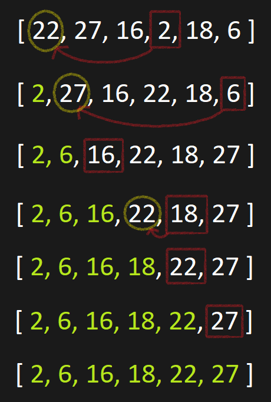
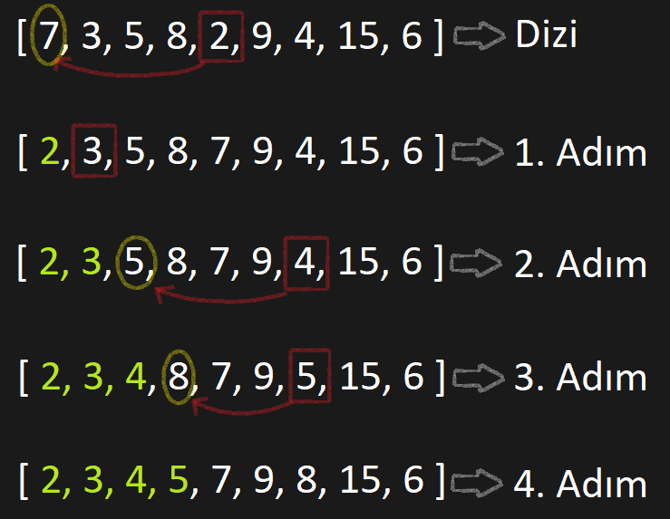

# Insertion Sort Projesi

# 1. Soru
Dizi;
>[22, 27, 16, 2, 18, 6]

## 1. Insertion Short Türüne Göre Sıralanışı
1. Yukarıda verilen dizi, ***Insertion Short*** algoritması ile aşağıdaki adımlara göre sıralanmıştır.



## 2. Big-O Gösterimi

1. Sıralamada her adımda input sayısı kadar karşılaştırma yapıyor.
```
 = n + (n - 1) + (n - 2) + ........ + 2 + 1

 = 1 + 2 + ........ + (n - 2) + (n - 1) + n

 = (n * (n + 1)) / 2

 = (n^2 + n) / 2

 n^2 ifadesi dominant olduğu için Big-O gösterimi;

 O(n^2) şeklindedir.
```
## 3. Time Complexity

> ### 1. Average Case:
   Aranan değer ortada olması durumunda yine de başlangıçta n/2 kadar işlem yapılacak. Bu durumda;
```
 = n/2 + (n/2 - 1) + (n/2 - 2) + ........ + 2 + 1

 = 1 + 2 + ........ + (n/2 - 2) + (n/2 - 1) + n/2

 = (n/2 * (n/2 + 1)) / 2

 = ((n^2)/4 + n/2) / 2

 n^2 ifadesi dominant olduğu için Big-O gösterimi;

 O(n^2) şeklindedir.
```
> ### 2. Worst Case:
   Aranan değer sonda olması durumunda başlangıçta n kadar işlem yapılacak. Bu durumda;
```
 = n + (n - 1) + (n - 2) + ........ + 2 + 1

 = 1 + 2 + ........ + (n - 2) + (n - 1) + n

 = (n * (n + 1)) / 2

 = (n^2 + n) / 2

 n^2 ifadesi dominant olduğu için Big-O gösterimi;

 O(n^2) şeklindedir.
```
> ### 3. Worst Case:
   Aranan değer dizinin en başında olması durumunda başlangıçta n kadar işlem yapılacak. Bu durumda;
```
Big-O gösterimi;

 O(n) şeklindedir.
```
## 4. Dizi sıralandıktan sonra 18 sayısı hangi case kapsamına girer?

Dizinin sıralanmış hali;
> [2, 6, 16, 18, 22, 27]

18 sayısı dizinin ortalarında olduğu için ***Average Case*** kapsamındadır.

# 2. Soru " dizisinin Insertion Sort'a göre ilk 4 adımını yazınız. "
Dizi;
>[7, 3, 5, 8, 2, 9, 4, 15, 6]

İnsertion Sort'un İlk 4 Adımı;


 # License 

 [MIT](https://github.com/bhtyrbyr/kodluyoruzilkrepo/blob/main/LICENSE)